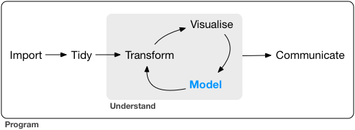

```{r setup, include=FALSE}
options(htmltools.dir.version = FALSE)
knitr::opts_chunk$set(cache = TRUE)
```

class: inverse, center, middle
background-image: url(./img/seurat.jpg)
background-size: cover
background-position: 50% 50%

# Introduction à R

</BR>
</BR>
</BR>

###  Joël Gombin, avec Timothée Gidoin


.right[.footnote[<a href='https://commons.wikimedia.org/wiki/File%3ASeurat-Gravelines-Annonciade.jpg'>source</a>]]


---
class: center, middle

Retrouvez les matériaux sur https://github.com/datactivist/formation_angie 

Ces slides en ligne : http://datactivi.st/formation_angie/jour1.html

Pad collaboratif : https://frama.link/angie

---
class: inverse, center, middle

## Faisons connaissance

https://frama.link/formationR

???

Recueillir les réponses, générer le dashboard et montrer et expliquer le code

---
## One tool to rule them all

- R a comme avantage d'être un langage de programmation (= potentiel illimité) pensé exprès pour la manipulation des données (= usabilité, flexibilité)

- au fil du temps, devenu un "general purpose tool"

- permet d'interfacer de nombreux outils plus spécialisés

- une communauté très dynamique (free software)

- une syntaxe de plus en plus facile

- des progrès vers [des bouts de GUI](https://rstudio.github.io/rstudioaddins/)

---
## Se faire aider

   * Un livre sur R : [R for Data Science](http://r4ds.had.co.nz) de G. Grolemund et H. Wickham 

   * blogs : https://www.r-bloggers.com (des carnets hypothèses: https://quanti.hypotheses.org/, https://politbistro.hypotheses.org)

   * des listes de diffusion thématiques (ex : [la liste quanti](mailto:quanti@groupes.renater.fr), semin-r@mnhn.fr, r-soc@groupes.renater.fr), des forums (http://forums.cirad.fr/logiciel-R/)

   * un site de Q/R communautaires : http://stackoverflow.com/questions/tagged/r

   * twitter avec le hashtag [#Rstats](https://twitter.com/search?q=%23rstats)

   * les [meetup R](https://www.meetup.com/fr-FR/rparis/)

---
## Installation de R et Rstudio

   * [Installation de R](https://cloud.r-project.org/)
   
   * Sous windows télécharger [R Tools](https://cran.r-project.org/bin/windows/Rtools/)
   
   * Sous MacOS X il faut probablement [installer les "command line tools" ou un compilateur gcc](https://github.com/kennethreitz/osx-gcc-installer) (pour pouvoir compiler des packages lorsque nécessaire)
   
   * Installer ensuite [Rstudio](https://www.rstudio.com/products/rstudio/download/preview/)

---
## Prise en main de Rstudio

- raccourci pour exécuter une ligne de code : ctrl + entrée, pomme + entrée pour Mac

---
## Scripts, litterate programming, reproducible research

- toujours travailler dans le cadre d'un "projet"

- ne jamais travailler dans la console

- écrire des scripts

- mieux : mêler texte et code au moyen de [fichiers Rmd](http://rmarkdown.rstudio.com/)

- versionage (git)

- notebook

- commentez ! (avec le #)

```{r}
# ceci est un commentaire
```

---
## Le workflow de l'analyse de données : 

```{r, echo = FALSE, out.width='90%', fig.align='center'}

```

---
## Installation du tidyverse

* Le `tidyverse` (ou hadleyverse) opérationnalise le workflow

* Pour installer le tidyverse, entrez dans la console : `install.packages("tidyverse")` (ou via Rstudio)

* `library(tidyverse)` => charge le package

---
class: inverse, center, middle

# Importer des données

---
## En GUI ou en CLI

- bouton "Import dataset"

- en CLI : package `readr` pour le CSV, `haven` pour SPSS / SAS / Stata, `readxl` pour le XLS(X), `rio` pour (presque) tout le reste

---
## Importez votre premier jeu de données !

- chargement de package : `library(readr)`

- Attention à l'assignation : 

  `monjeudedonnees <- read_csv("monfichier.csv")` 

- Importons le dataset Keolis 

---
## Importez votre premier jeu de données !

```{r }
suppressPackageStartupMessages(library(tidyverse))
keolis <- read_csv("./data/Corpus_Mobilité.csv")

```

## Importez votre premier jeu de données !

Si besoin, ajuster l'import au moyen des arguments `col_types`, `locale` ou encore `na`

```{r}
keolis <- read_csv("./data/Corpus_Mobilité.csv",
                       na = "",
                       col_types = cols(
  .default = col_character(),
  id = col_character(),
  time = col_integer(),
  created_at = col_datetime(format = ""),
  possibly_sensitive = col_integer(),
  truncated = col_integer(),
  retweet_count = col_integer(),
  favorite_count = col_integer(),
  in_reply_to_status_id = col_character(),
  quoted_status_id = col_character(),
  lat = col_double(),
  lng = col_double(),
  from_user_id = col_character(),
  from_user_verified = col_integer(),
  from_user_utcoffset = col_integer(),
  from_user_tweetcount = col_integer(),
  from_user_followercount = col_integer(),
  from_user_friendcount = col_integer(),
  from_user_favourites_count = col_integer(),
  from_user_listed = col_integer(),
  from_user_created_at = col_datetime(format = "")
))
```

---
## La notion de fonction

```{r}
sum(1, 2, 3)

a <- sum(1, 2, 3)

a
```


---
class: inverse, center, middle
# Le tidyverse 

---
## La notion de tidy data

> “Happy families are all alike; every unhappy family is unhappy in its own way.” – Leo Tolstoy

> “Tidy datasets are all alike, but every messy dataset is messy in its own way.” – Hadley Wickham

- À chaque variable sa propre colonne

- À chaque observation sa propre ligne

- À chaque valeur sa propre cellule

---
## La notion de tidy data

```{r, echo = FALSE, out.width='90%', fig.align='center'}
knitr::include_graphics("./img/tidy-1.png")
``` 

---
## La notion de tidy data

- À chaque observation sa propre ligne

- À chaque variable sa colonne

- À chaque valeur sa propre cellule > 1 jeu de données par table, dite “tibble”

---
## Un exemple de untidy data

https://www.data.gouv.fr/fr/datasets/election-presidentielle-2012-resultats-572126/

---
## Préparer des tidy data

- `dplyr` et `tidyr`

- le pipe : `%>%` (ctrl/cmd + shift + M)

- les verbes : 
  + `filter` (et `slice`)
  + `arrange`
  + `select` (et `rename`)
  + `distinct`
  + `mutate` 
  + `group_by` 
  + `summarise`
  + `sample_n` / `sample_frac`

- `stringr` peut utilement accompagner 


---
## Pivoter

`gather` et `spread`

```{r, echo = FALSE, out.width='90%', fig.align='center'}
knitr::include_graphics("http://r4ds.had.co.nz/images/tidy-9.png")
```

---
## Pivoter

```{r}
keolis %>% 
  gather(variable, valeur, retweet_count, favorite_count) %>% 
  select(id, created_at, variable, valeur)
```

